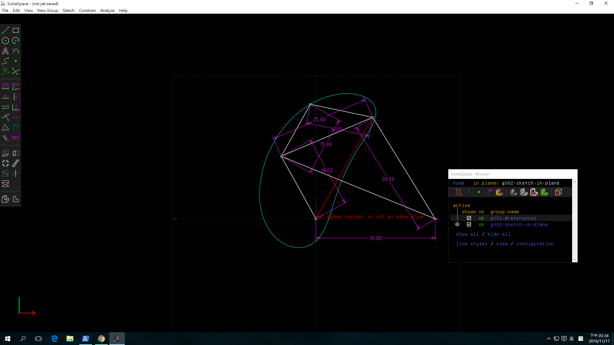
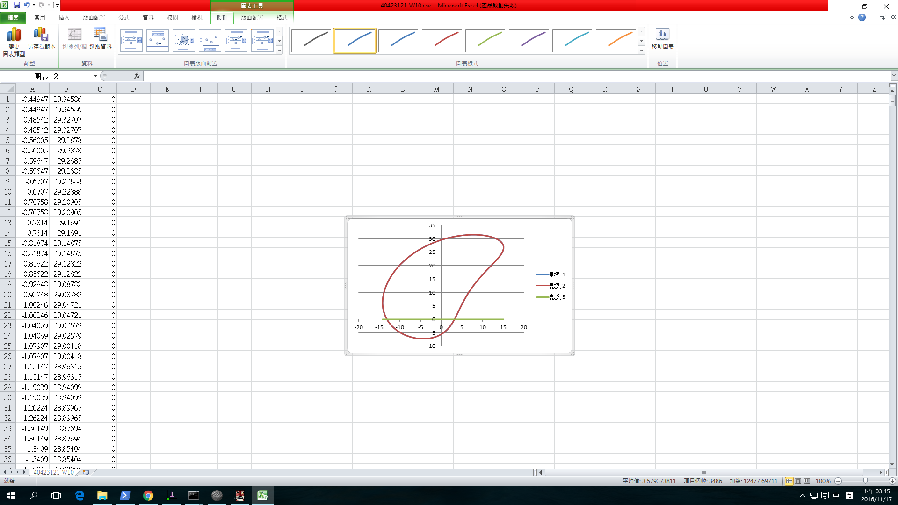

Title: 電腦輔助設計實習課程總結
Date: 2017-01-12 12:00
Category: 40423121 林秉憲
Tags: 總結
Author: 40423121 林秉憲

從一開始的Solvespace 平面四連桿機構模擬

將所得到的點座標的.csv以Excel的畫圖，得到：

###到繪製Solvespace 
<iframe src="./../w7/1215.html" width="800" height="600"></iframe>

和3d印表機零件繪製
## 支柱
<iframe src="./../w7/3d/20161217-1.html" width="800" height="600"></iframe>
## 連接桿
<iframe src="./../w7/3d/20161217.html" width="800" height="600"></iframe>
## 底盤
<iframe src="./../w7/3d/20161217-5.html" width="800" height="600"></iframe>
## 圓盤
<iframe src="./../w7/3d/20161217-3.html" width="800" height="600"></iframe>

## 3D列印機
<iframe src="./../w7/3d/1222.html" width="800" height="600"></iframe>

